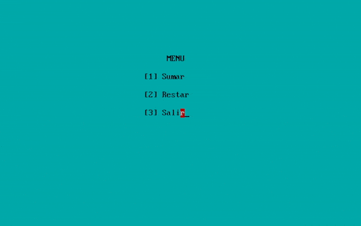

# ASM-Menu-Mouse
An assembly program ("Menu with Mouse") demonstrating interactive menu navigation, arithmetic operations, and mouse interaction in x86 assembly (MASM).

## How to run
<u>**You can run a ASM code on many different ways, it will depend on your system and/or your preferences**</u>.

One of my favorite are using Turbo ASM to edit, compile and run ASM files.

1. Download and install TurboASM [https://sourceforge.net/projects/guitasm8086/](https://sourceforge.net/projects/guitasm8086/)
2. With TurboASM open the file `menuwmouse.asm`
3. Assemble, Build and Execute the file using the buttons on the toolbar or with the hotkey `F9`
